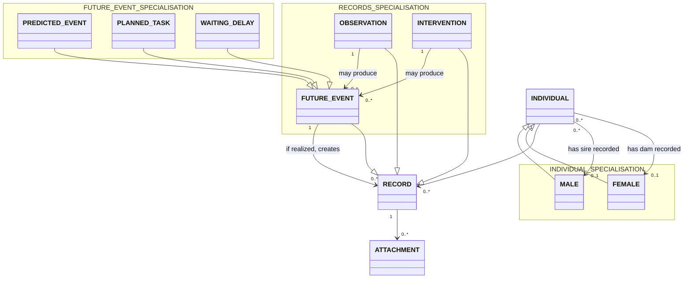

# Business Object Model

## Business object Descriptions

### Individual
Individual represents a sheep in the flock with identity, lifecycle, and lineage information.

- Bounded context: Individual Management.
- Key attributes:
    - id (REQ-01.001)
    - name (optional)
    - bdtaNumber (optional) (REQ-01.002, REQ-01.003)
    - birthDate (REQ-01.004)
    - deathDate (optional) (REQ-01.004)
    - sex (REQ-01.005)
    - colorPattern (optional) (REQ-01.005)
    - living (REQ-01.005)
    - stillborn (REQ-01.004)
    - portraitReference (optional) (REQ-01.006)
    - sire (optional) (REQ-01.005)
    - dam (optional) (REQ-01.005)
- Key business rules:
    - Each individual has a mandatory unique internal identifier (REQ-01.001).
    - BDTA number can be assigned later and is not required at first capture (REQ-01.003).
    - Stillborn individuals keep birth and death dates as the same date (REQ-01.004).
    - No post-birth observations for stillborns are treated as a domain assumption (TASK-0003 assumption).
    - For stillborns, living status is treated as always dead (TASK-0003 assumption).
    - Each individual has a visual representation from an observed portrait or generated icon (REQ-01.006).
    - Phenotype-driven icon generation is supported (REQ-09.001).
    - Parentage is modeled with sire and dam links (REQ-01.005).
    - At most one sire and at most one dam, and parent role sex semantics, are treated as domain assumptions (TASK-0003 assumption).

### Male
Male is a specialization of Individual for individuals recorded with male sex (REQ-01.005).

- Bounded context: Individual Management.
- Key attributes:
    - inherits Individual attributes (REQ-01.005)
- Key business rules:
    - Male can play the sire role in parentage links (TASK-0003 assumption).

### Female
Female is a specialization of Individual for individuals recorded with female sex (REQ-01.005).

- Bounded context: Individual Management.
- Key attributes:
    - inherits Individual attributes (REQ-01.005)
- Key business rules:
    - Female can play the dam role in parentage links (TASK-0003 assumption).

### Record
Record is the shared journal entry supertype for Observation, Intervention, and FutureEvent (TASK-0003 assumption).

- Bounded context: Records and Journal.
- Key attributes:
    - id
- Key business rules:
    - A record can appear in the journal of one or more individuals so batch capture is represented without losing per-individual chronology (REQ-04.002, REQ-04.007).
    - Records may have attachments for evidence or reference, such as photos or PDFs (REQ-04.007).

### Observation
Observation specializes Record (TASK-0003 assumption) and covers weight evolution, health observations, medical analysis results, and reproduction events (REQ-04.001, REQ-04.009).

- Bounded context: Records and Journal.
- Key attributes:
    - observationType (REQ-04.001)
    - observedAt (TASK-0003 assumption)
    - content (REQ-04.009)
    - selectedIndividuals (REQ-04.002, REQ-04.003)
- Key business rules:
    - A single observation may be applied to multiple selected individuals (REQ-04.002).
    - Medical analysis results are stored as observation content and do not require a separate business object (REQ-04.009).

### Intervention
Intervention specializes Record (TASK-0003 assumption) and captures performed actions, care, and treatment information (REQ-04.002, REQ-04.005, REQ-04.008).

- Bounded context: Records and Journal.
- Key attributes:
    - interventionType (REQ-04.005)
    - performedAt (REQ-04.008)
    - selectedIndividuals (REQ-04.002, REQ-04.003)
- Key business rules:
    - A single intervention may be applied to multiple selected individuals (REQ-04.002).
    - Intervention data can include treatment dose and quarantine-related information (REQ-04.005, REQ-04.008).

### FutureEvent
FutureEvent represents a derived event or reminder that is planned, predicted, waiting, realized, or aborted depending on the context. It specializes Record and is the parent concept for PredictedEvent, PlannedTask, and WaitingDelay (REQ-04.004, REQ-04.005, REQ-04.006, REQ-04.010, REQ-05.002, REQ-05.003).

- Bounded context: Future Events and Reminders.
- Key attributes:
    - id
    - futureEventType (REQ-04.004, REQ-04.005, REQ-04.006, REQ-04.010, REQ-05.002, REQ-05.003)
    - status (TASK-0003 assumption)
    - sourceRecord (REQ-04.004, REQ-04.005, REQ-04.006)
- Key business rules:
    - Future events are derived from observations or interventions (REQ-04.004, REQ-04.005, REQ-04.006).
    - Realization of future events through concrete records is treated as a domain assumption (TASK-0003 assumption).
    - Aborted or never-occurring future events are treated as a domain assumption (TASK-0003 assumption).

### PredictedEvent
PredictedEvent is a FutureEvent used for probabilistic outcomes based on prior records.

- Bounded context: Future Events and Reminders.
- Key attributes:
    - earliestDate (REQ-04.004)
    - latestDate (REQ-04.004)
    - status (TASK-0003 assumption)
- Key business rules:
    - Mating observation can produce a predicted birth window between day 140 and day 150 (REQ-04.004).

### PlannedTask
PlannedTask is a FutureEvent representing a concrete upcoming action to perform.

- Bounded context: Future Events and Reminders.
- Key attributes:
    - title
    - reminderDate (REQ-04.006, REQ-04.010, REQ-05.003)
    - dueDate (REQ-04.006, REQ-05.002)
    - completionStatus (TASK-0003 assumption)
- Key business rules:
    - A confirmed birth can derive a weaning planned task around 3 months later (REQ-04.006).

### WaitingDelay
WaitingDelay is a FutureEvent representing a delay interval that must elapse before normal operations resume.

- Bounded context: Future Events and Reminders.
- Key attributes:
    - title
    - delayElapsedAt (REQ-04.005)
    - elapsed (REQ-04.005)
- Key business rules:
    - WaitingDelay models elapsed periods such as intervention-related quarantine windows (REQ-04.005).

### Attachment
Attachment represents documentary evidence linked to a record.

- Bounded context: Records and Journal.
- Key attributes:
    - id
    - attachmentType (REQ-04.007)
    - label (optional)
    - capturedAt (optional)
- Key business rules:
    - Attachment metadata is associated with records for evidence and reference, such as photos or PDFs (REQ-04.007).

### TraitAssessment (Placeholder)
TraitAssessment is a placeholder entity for phenotype capture and uncertain genotype representation while deduction rules remain to be detailed.

- Bounded context: Trait Assessment Placeholder.
- Key attributes:
    - id
    - traitIdentifier (TASK-0003 assumption)
    - phenotype (optional) (REQ-03.001)
    - genotype (optional) (REQ-03.002)
    - genotypeConfirmed (optional) (REQ-03.002)
- Key business rules:
    - TraitAssessment captures phenotype and genotype deduction capability while detailed deduction rules remain unspecified (REQ-03.001, REQ-03.002, REQ-03.003, REQ-03.004).
    - Genotype can be unconfirmed and represent uncertainty, including multiple alleles for a gene when needed (REQ-03.002).
