# Reproduction Cycle — Business Process

## Overview

The reproduction cycle for a ewe spans from breeding season planning through lambing and post-lambing follow-up. This end-to-end process covers six phases: heat (estrus) planning and detection, mating/breeding, pregnancy diagnosis, gestation management, lambing preparation, and lambing. The process involves the shepherd (who manages day-to-day flock operations and records observations) and the veterinarian (who performs pregnancy diagnostics and advises on re-mating). Automated derivations (predicted lambing windows, lamb record proposals, weaning tasks) are triggered as side effects of shepherd-recorded observations per encoded business rules.

## Participants

| Actor | Role |
|-------|------|
| Shepherd | Plans breeding, observes heat, performs/introduces mating, records observations, manages gestation, prepares for lambing, records lambing, creates lamb records, assigns parentage |
| Veterinarian | Performs pregnancy diagnosis (ultrasound, blood test), confirms or rules out pregnancy, advises on re-mating |

## Process Steps

| Step | Actor | Action | Notes |
|------|-------|--------|-------|
| 1 | Shepherd | Plan breeding season and select rams for mating groups | Flock Manager configures weaning delay setting |
| 2 | Shepherd | Observe ewes for heat signs; record heat observations | Visual observation of estrus behavior |
| 3 | Shepherd | If ewe is in heat, introduce ram or arrange artificial insemination | Natural mating or AI |
| 4 | Shepherd | Record mating observation in the ewe's journal | Triggers BR-012: system derives predicted lambing event (140-150 day window) and adds to calendar per REQ-05.002 |
| 5 | Shepherd | Monitor ewe for return to heat (~18-21 days post mating) | If ewe returns to heat, she was not pregnant; return to step 3 |
| 6 | Shepherd | Schedule pregnancy diagnosis with veterinarian | If no return to heat, presumptive pregnant |
| 7 | Veterinarian | Perform pregnancy examination (ultrasound / blood test) | |
| 8 | Veterinarian | Confirm or rule out pregnancy | If not pregnant, advise re-mating |
| 9 | Shepherd | If confirmed pregnant, manage gestation | Monitor health, BCS, nutrition |
| 10 | Shepherd | Track predicted lambing window | BR-012: window is mating date +140 to +150 days; shown in calendar |
| 11 | Shepherd | Prepare lambing pen and supplies | |
| 12 | Shepherd | Move ewe to lambing pen as predicted window approaches | |
| 13 | Shepherd | Record lambing observation in the ewe's journal | BR-022: only female individuals can have lambing observations |
| 14 | Shepherd | Determine if lambs are born alive or stillborn | Stillborn per BR-004: birthDate = deathDate, no Records/FutureEvents |
| 15 | Shepherd | Create Individual record for each live lamb | System proposes N lamb records where N = lamb count from observation; user can accept, defer, or dismiss (BR-022) |
| 16 | Shepherd | Assign parentage (sire and dam links) for each lamb | BR-005: sire must be male, dam must be female |
| 17 | Shepherd | Post-lambing follow-up begins | BR-022: system generates weaning PlannedTask for each created lamb at configurable interval |

## Diagram

```mermaid
flowchart LR
    subgraph Shepherd["Shepherd"]
        direction TB

        S1(["Start: Plan breeding season"]) --> S2[Select rams\nfor mating groups]
        S2 --> S3[Observe ewes for heat signs\nRecord heat observations]
        S3 --> S4{Ewe in heat?}

        S4 -->|Yes| S5[Introduce ram or\narrange artificial insemination]
        S4 -->|No, continue monitoring| S3

        S5 --> S6[Record mating observation\nin ewe's journal]
        S6 --> S7[Monitor for return to heat\n~18-21 days post mating]
        S7 --> S8{Returned to heat?}

        S8 -->|Yes - not pregnant| S5
        S8 -->|No - presumptive pregnant| S9[Schedule pregnancy diagnosis\nwith veterinarian]

        S9 -.->|Refer for diagnosis| P1

        S10[Manage gestation:\nmonitor health, BCS, nutrition] --> S11[Track predicted lambing window\nMating +140 to +150 days]

        S11 --> S13[Prepare lambing pen\nand supplies]
        S13 --> S14[Move ewe to lambing pen\nAs predicted window approaches]
        S14 --> S15[Record lambing observation\nin ewe's journal]
        S15 --> S16{Live birth?}

        S16 -->|Yes| S17[Create Individual record\nfor each live lamb]

        S16 -->|No, stillborn| S18[Record stillborn\nbirthDate = deathDate]

        S17 --> S19[Assign parentage\nsire & dam links]
        S18 --> S19
        S19 --> S20["End: Post-lambing follow-up\nWeaning PlannedTask generated\nfor each lamb"]
    end

    subgraph Veterinarian["Veterinarian"]
        direction TB
        P1[Perform pregnancy exam\nUltrasound / blood test]
        P1 --> P2{Confirmed pregnant?}
        P2 -->|Yes| P3[Confirm pregnancy\nProvide care guidance]
        P2 -->|Not pregnant| P4[Advise ewe is not pregnant\nRecommend re-mating]
    end

    P3 -.->|Result: pregnant| S10
    P4 -.->|Result: not pregnant| S5
```

## References

| Reference | Description |
|-----------|-------------|
| [REQ-04](../../docs/requirements/business/REQ-04.md) | Observations and Reproductive Planning — parent requirement group |
| [REQ-04.001](../../docs/requirements/business/REQ-04.001.md) | Observation types include weight evolution, health observations, and reproduction events |
| [REQ-04.004](../../docs/requirements/business/REQ-04.004.md) | Mating observation produces lambing planned event at 140–150 days |
| [REQ-04.005](../../docs/requirements/business/REQ-04.005.md) | Confirmed lambing proposes creation of lamb records and weaning event |
| [REQ-05.002](../../docs/requirements/business/REQ-05.002.md) | Calendar integrates predicted future events such as lambing and heat seasons |
| [BR-012](../../docs/business-rules/BR-012-lambing-prediction-based-on-mating-observation.md) | Lambing prediction based on mating observation |
| [BR-022](../../docs/business-rules/BR-022-lambing-process-flow.md) | Lambing Process Flow — lamb record proposal, weaning task, sex constraint |
| [BR-015](../../docs/business-rules/BR-015-future-event-realization.md) | Future Event Realization — PredictedEvent→Observation, PlannedTask→Intervention |
| [BR-005](../../docs/business-rules/BR-005-parentage-role-semantics.md) | Parentage Role Semantics — sire=Male, dam=Female |
| [BR-004](../../docs/business-rules/BR-004-stillborn-lifecycle-progression.md) | Stillborn Lifecycle Progression — birthDate=deathDate, no Records/FutureEvents |
| [BR-003](../../docs/business-rules/BR-003-lifecycle-date-constraints.md) | Lifecycle Date Constraints — birthDate mandatory, deathDate optional |
| [Business Glossary](../../docs/domain-model/business-glossary.md) | Canonical terms: Lambing, Predicted Lambing Date, Weaning, Stillborn, Sire, Dam, etc. |
| [Business Object Model](../../docs/domain-model/object-model/business-object-model.md) | Domain objects: Individual, Observation, PredictedEvent, PlannedTask, FutureEvent |
