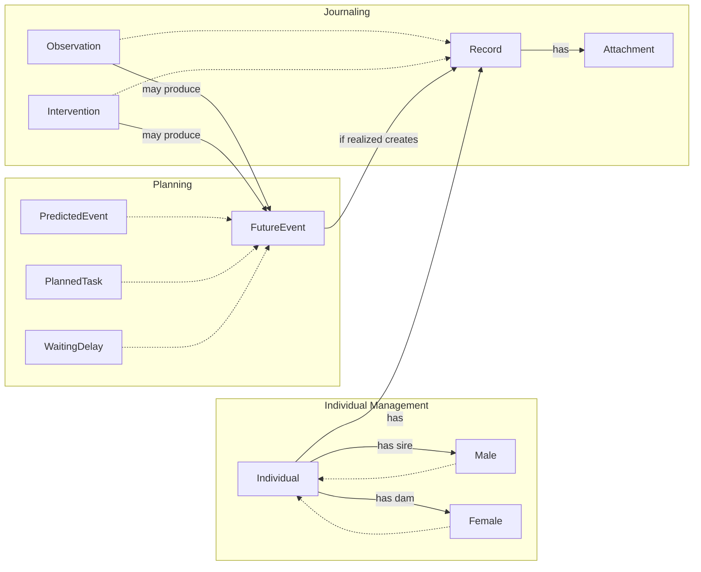
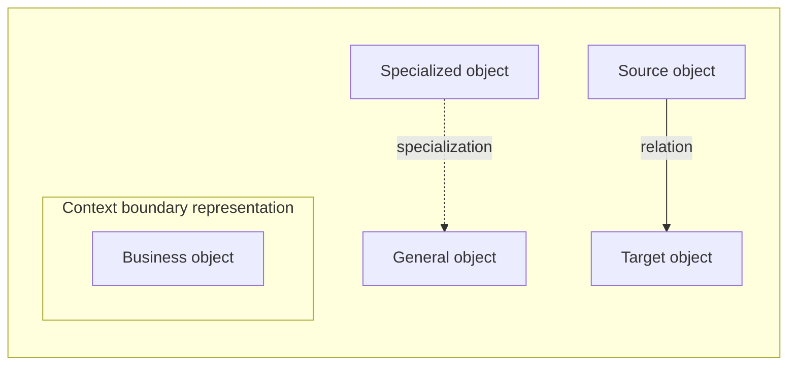

# Business Object Model

### Legend

## Business object Descriptions

### Individual
Individual represents a sheep managed or referenced in the system, with identity, lifecycle, lineage information, and flock membership tracking.

- Bounded context: Individual Management.

### Male
Male is a specialization of Individual for individuals recorded with male sex. Different business rules will apply to male and female.

- Bounded context: Individual Management.

### Female
Female is a specialization of Individual for individuals recorded with female sex. Different business rules will apply to male and female.

- Bounded context: Individual Management.

### Record
Record is the shared journal entry supertype for Observation, Intervention, and FutureEvent.

- Bounded context: Journaling.

### Observation
Observation specializes Record and covers weight evolution, health observations, medical analysis results, reproduction events, and flock membership events.

- Bounded context: Journaling.

### Intervention
Intervention specializes Record and captures performed actions, care, and treatment information.

- Bounded context: Journaling.

### FutureEvent
FutureEvent represents a derived event or reminder that is planned, predicted, waiting, realized, or aborted depending on context.

- Bounded context: Planning.

### PredictedEvent
PredictedEvent is a FutureEvent used for probabilistic outcomes based on prior records.

- Bounded context: Planning.

### PlannedTask
PlannedTask is a FutureEvent representing a concrete upcoming action to perform.

- Bounded context: Planning.

### WaitingDelay
WaitingDelay is a FutureEvent representing a delay interval that must elapse before normal operations resume.

- Bounded context: Planning.

### Attachment
Attachment represents documentary evidence linked to a record.

- Bounded context: Journaling.
