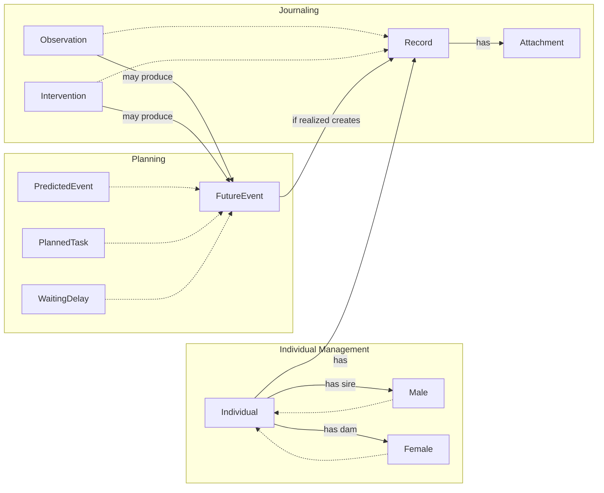
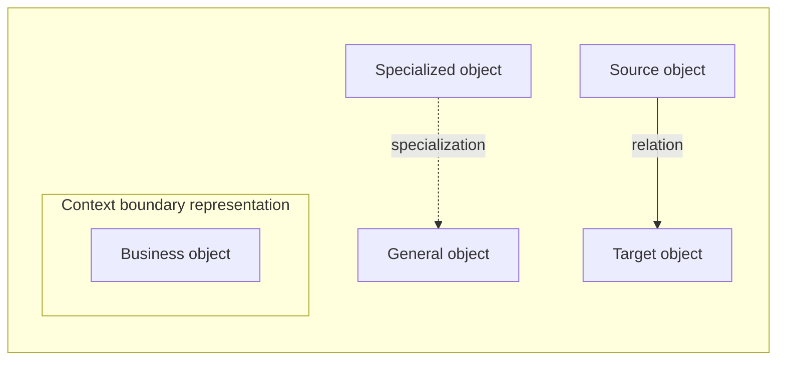

# Business Object Model

### Legend

## Business object Descriptions

### Individual
Individual represents a sheep managed or referenced in the system, with identity, lifecycle, lineage information, and flock membership tracking.

- Bounded context: Individual Management.

**Example:**

*Scenario – Marguerite, a 3-year-old Tarasconnaise ewe, is added to the GAEC du Pic Saint-Loup flock after being purchased.*

### Male
Male is a specialization of Individual for individuals recorded with male sex. Different business rules will apply to male and female.

- Bounded context: Individual Management.

**Example:**

*Scenario – César is a Lacaune ram purchased for the 2025 breeding season, used as a sire for 60 ewes.*

### Female
Female is a specialization of Individual for individuals recorded with female sex. Different business rules will apply to male and female.

- Bounded context: Individual Management.

**Example:**

*Scenario – Noisette is a 5-year-old ewe with 4 lambing cycles, currently suspected gestating.*

### Record
Record is the shared journal entry supertype for Observation, and Intervention.

- Bounded context: Journaling.

**Example:**

*Scenario – A generic journal entry recording Marguerite's arrival. (Supertype — in practice only specializations are instantiated.)*

### Observation
Observation specializes Record and covers weight evolution, health observations, medical analysis results, reproduction events, and flock membership events.

- Bounded context: Journaling.

**Example:**

*Scenario – Noisette is observed in with a mating mark on 2025-03-22. This observation trigger a planned event for the expected lambing.*

### Intervention
Intervention specializes Record and captures performed actions, care, and treatment information.

- Bounded context: Journaling.

**Example:**

*Scenario – Preventive vaccination against BTV on the March-born lamb batch.*

### FutureEvent
FutureEvent represents a derived event or reminder.

- Bounded context: Planning.

**Example:**

*Scenario – A predicted lambing date (2025-08-14) calculated from the observed heat. (Supertype — in practice only specializations are instantiated.)*

### PredictedEvent
PredictedEvent is a FutureEvent used for probabilistic outcomes based on prior records.

- Bounded context: Planning.

**Example:**

*Scenario – The system predicts Noisette's next mating window (~2025-07-15) based on her lambing history.*

### PlannedTask
PlannedTask is a FutureEvent representing a concrete upcoming action to perform.

- Bounded context: Planning.

**Example:**

*Scenario – Task: scan Noisette for pregnancy 45 days after detected heat, assigned to Marie Robert.*

### WaitingDelay
WaitingDelay is a FutureEvent representing a delay interval that must elapse before normal operations resume.

- Bounded context: Planning.

**Example:**

*Scenario – Noisette was injected Metacam for a painful shoulder. A 7-day withdrawal period for meat and milk must be respected.*

### Attachment
Attachment represents documentary evidence linked to a record.

- Bounded context: Journaling.

**Example:**

*Scenario – Ultrasound scan photo from Noisette's pregnancy check, attached to the Observation record.*
