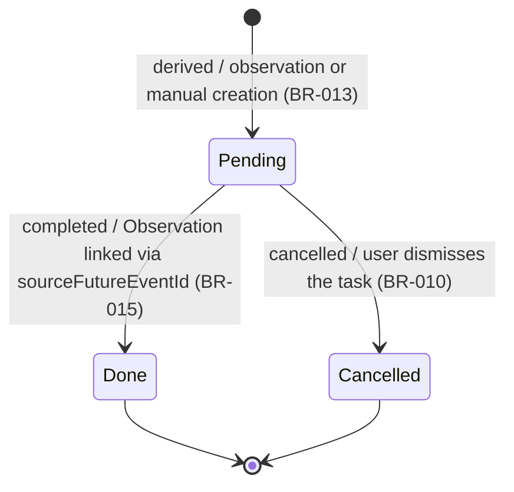

# PlannedTask — State Diagram

PlannedTask is a specialization of FutureEvent representing a concrete upcoming action to perform (e.g., a weaning reminder, a shearing task). It uses the `TaskStatus` enum with three lifecycle states.

## States

| State | Description |
|-------|-------------|
| `Pending` | Awaiting completion — the task is scheduled. Initial state upon derivation (e.g., from a confirmed birth via BR-013, or manual creation). |
| `Done` | The task was completed. Realization is captured by creating a new Observation referencing this PlannedTask via `sourceFutureEventId`. Terminal state. |
| `Cancelled` | The task is no longer required (e.g., the animal was sold, the context changed). Terminal state. |

## Transitions

| From | To | Trigger | Conditions |
|------|----|---------|------------|
| `[*]` | `Pending` | PlannedTask is derived | A qualifying record (e.g., a confirmed birth observation) triggers derivation, or the user manually creates a task. BR-013 calculates `dueDate` (e.g., birth date + 3 months for weaning). |
| `Pending` | `Done` | User marks task as done | An Observation is created referencing this PlannedTask as its source via `sourceFutureEventId`, recording the actual completion. [BR-015] |
| `Pending` | `Cancelled` | User cancels the task | The user explicitly dismisses or cancels the task (e.g., it is no longer relevant). [BR-010] |
| `Done` | `[*]` | — | Terminal state — no further transitions. |
| `Cancelled` | `[*]` | — | Terminal state — no further transitions. |

## Diagram

