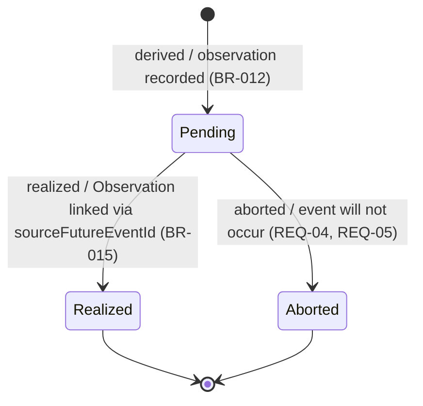

# Predicted Event — State Diagram

Predicted Event is a specialization of Future Event representing a probabilistic outcome with an expected date range (e.g., a predicted birth window from a mating observation). It uses the `PredictionStatus` enum with three lifecycle states.

## States

| State | Description |
|-------|-------------|
| `Pending` | Awaiting realization — the predicted event is expected to occur within the date range (`earliestDate`–`latestDate`). Initial state upon derivation. |
| `Realized` | The predicted event occurred and was recorded via an Observation referencing this PredictedEvent via `sourceFutureEventId`. Terminal state. |
| `Aborted` | The predicted event will not occur (e.g., the user confirms the animal did not give birth within the expected window). Terminal state. |

## Transitions

| From | To | Trigger | Conditions |
|------|----|---------|------------|
| `[*]` | `Pending` | PredictedEvent is derived | A mating observation (or other qualifying record) is recorded. BR-012 calculates `earliestDate` and `latestDate` based on the observation timestamp. |
| `Pending` | `Realized` | Observation recorded with `sourceFutureEventId` | A new Observation is created that references this PredictedEvent as its source. The Observation captures the actual event (e.g., a birth record). [BR-015] |
| `Pending` | `Aborted` | User or system aborts the prediction | The predicted event is confirmed as not occurring (e.g., the birth window has passed without a corresponding Observation, or the user explicitly cancels the prediction). [REQ-04, REQ-05] |

## Diagram

