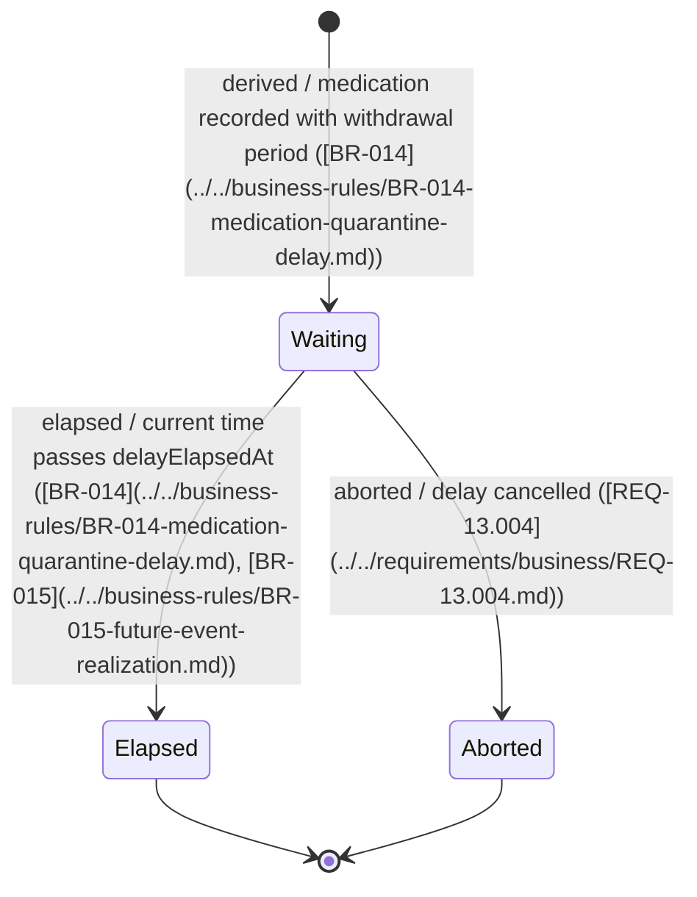

# WaitingDelay — State Diagram

WaitingDelay is a specialization of FutureEvent representing a delay interval that must elapse before normal operations resume (e.g., a quarantine withdrawal period after medication administration). It uses the `DelayStatus` enum with three lifecycle states.

## States

| State | Description |
|-------|-------------|
| `Waiting` | Delay period in progress — the waiting interval is active. Initial state upon derivation from a medication intervention. |
| `Elapsed` | The delay period has ended — the current time has passed `delayElapsedAt`. Terminal state. |
| `Aborted` | The delay was cancelled before elapsing (e.g., the medication was invalidated). Terminal state. |

## Transitions

| From | To | Trigger | Conditions |
|------|----|---------|------------|
| `[*]` | `Waiting` | WaitingDelay is derived | A medication intervention with withdrawal period specifications is recorded. [BR-014](../../business-rules/BR-014-medication-quarantine-delay.md) calculates `delayElapsedAt` from medication date + product-specific withdrawal duration. One or two WaitingDelay entries are created per [BR-007](../../business-rules/BR-007-quarantine-period-representation.md) (meat withdrawal, milk withdrawal, or both). |
| `Waiting` | `Elapsed` | System detects that current time >= `delayElapsedAt` | The delay period naturally ends when the current time reaches the calculated `delayElapsedAt`. Optionally, an Observation may be recorded referencing this WaitingDelay via `sourceFutureEventId` to confirm the delay completion. [[BR-014](../../business-rules/BR-014-medication-quarantine-delay.md), [BR-015](../../business-rules/BR-015-future-event-realization.md)] |
| `Waiting` | `Aborted` | User or system aborts the delay | The delay is cancelled (e.g., the medication is invalidated, or the withdrawal period is overridden). [[REQ-13.004](../../requirements/business/REQ-13.004.md)] |

## Diagram

