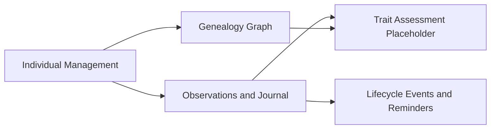
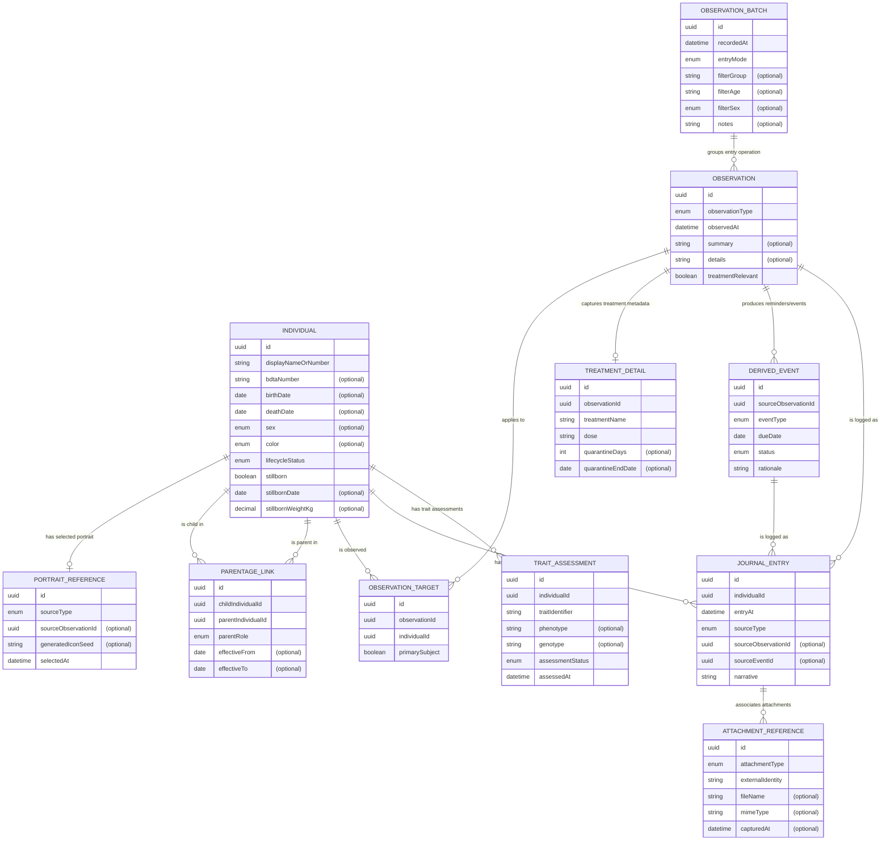

# 1. Overview

This domain model defines the mobile MVP business concepts for individual sheep records, genealogy parentage links, observations with derived reminders/events, and a placeholder trait-assessment capability, without prescribing storage or implementation details.

## 2. Context Map

Context relationships:
- Individual Management is upstream for identity and lifecycle attributes consumed by other contexts.
- Genealogy Graph consumes individuals and parent roles (sire/dam) to represent ancestry/descendency links.
- Observations and Journal consumes individuals as observation targets and produces chronological records.
- Lifecycle Events and Reminders is downstream of observations that trigger dated reminders/events.
- Trait Assessment is a scoped placeholder capability linked to individuals and traits, with no deduction algorithms defined yet.

## 3. Business Object Model

## 4. Entity Descriptions (Entity Catalog)

### Individual
- Bounded context: Individual Management.
- Key attributes: id, displayNameOrNumber, bdtaNumber (optional), birthDate (optional), deathDate (optional), sex (optional), color (optional), lifecycleStatus, stillborn, stillbornDate (optional), stillbornWeightKg (optional).
- Key business rules:
- Each individual has a unique internal identifier.
- BDTA number is optional at creation and can be assigned later.
- Birth and death dates are captured when available.
- Alive/dead status is represented by lifecycleStatus and can coexist with optional deathDate.
- Stillborn records are supported with limited fields (date, parents via parentage links, weight, color).

### PortraitReference
- Bounded context: Individual Management.
- Key attributes: id, sourceType, sourceObservationId (optional), generatedIconSeed (optional), selectedAt.
- Key business rules:
- An individual may have a selected portrait sourced from an observation attachment or from a generated icon identity.
- Portrait selection is independent from binary asset storage.

### ParentageLink
- Bounded context: Genealogy Graph.
- Key attributes: id, childIndividualId, parentIndividualId, parentRole, effectiveFrom (optional), effectiveTo (optional).
- Key business rules:
- Parentage is modeled as graph-compatible directed links.
- Parent roles support at least sire and dam semantics.
- A child may have zero, one, or multiple parentage links as data becomes available.

### ObservationBatch
- Bounded context: Observations and Journal.
- Key attributes: id, recordedAt, entryMode, filterGroup (optional), filterAge (optional), filterSex (optional), notes (optional).
- Key business rules:
- Batch entry groups one operator action that applies observations/treatments to multiple individuals.
- Selection can be represented by filters (group, age, sex) and/or explicit target selection on contained observations.

### Observation
- Bounded context: Observations and Journal.
- Key attributes: id, observationType, observedAt, summary (optional), details (optional), treatmentRelevant.
- Key business rules:
- Observation types include weight evolution, health observations, and reproduction events.
- An observation can affect one or multiple individuals through observation targets.
- Treatment-relevant observations may include treatment metadata and quarantine information.

### ObservationTarget
- Bounded context: Observations and Journal.
- Key attributes: id, observationId, individualId, primarySubject.
- Key business rules:
- Resolves many-to-many linkage between observations and individuals.
- Supports explicit affected individual(s) capture for both single and batch workflows.

### TreatmentDetail
- Bounded context: Observations and Journal.
- Key attributes: id, observationId, treatmentName, dose, quarantineDays (optional), quarantineEndDate (optional).
- Key business rules:
- Treatment date and dose are recorded as part of treatment-relevant observations.
- Quarantine period metadata is captured when treatment requires withdrawal constraints.

### DerivedEvent
- Bounded context: Lifecycle Events and Reminders.
- Key attributes: id, sourceObservationId, eventType, dueDate, status, rationale.
- Key business rules:
- Events/reminders are derived from triggering observations.
- Required derivations include:
- Mating observation -> birth reminder due at 140 days.
- Confirmed birth observation -> weaning event due at 3 months.
- Treatment observation -> quarantine reminder(s) based on treatment details.
- Additional supported reminder categories include heat period start, hoof trimming, vaccines, and shearing.

### JournalEntry
- Bounded context: Observations and Journal.
- Key attributes: id, individualId, entryAt, sourceType, sourceObservationId (optional), sourceEventId (optional), narrative.
- Key business rules:
- Each individual has a chronological journal.
- Observation and derived event facts are represented as journal entries.
- Journal entries preserve traceability of treatment dates, doses, and quarantine reminders.

### AttachmentReference
- Bounded context: Observations and Journal.
- Key attributes: id, attachmentType, externalIdentity, fileName (optional), mimeType (optional), capturedAt (optional).
- Key business rules:
- Attachments are modeled as metadata references (for example photo/PDF identity), not binary content.
- Attachments are associated to journal entries.

### TraitAssessment (Placeholder)
- Bounded context: Trait Assessment Placeholder.
- Key attributes: id, individualId, traitIdentifier, phenotype (optional), genotype (optional), assessmentStatus, assessedAt.
- Key business rules:
- Exists as explicit placeholder capability for phenotype/genotype deduction scope representation.
- Deduction algorithms and detailed inference rules are intentionally out of scope.

## 5. Business Rules

- Identifier rule: Every Individual has a mandatory unique internal identifier.
- Deferred registration rule: BDTA number is optional at creation time and can be assigned later.
- Lifecycle completeness rule: birthDate and deathDate are optional but should be captured when known.
- Stillborn rule: stillborn individuals are valid records with limited attributes (date, parents, weight, color).
- Parentage semantics rule: genealogy links are directed child-to-parent relationships with parentRole containing at least sire and dam.
- Observation scope rule: observations can target one or many individuals.
- Batch operation rule: one batch entry operation can generate multiple observations and/or shared observation content over multiple targets.
- Treatment traceability rule: treatment observations record dose and quarantine metadata when relevant.
- Derivation rule: specific observation types generate reminder/event obligations with due dates (mating + 140 days for birth reminder; confirmed birth + 3 months for weaning; treatment-driven quarantine reminders).
- Journal chronology rule: each individual journal is chronological and includes observation-derived and event-derived records.
- Attachment metadata rule: journal attachments are represented by metadata references and associations only.
- Placeholder capability rule: trait assessment is modeled, but phenotype/genotype deduction logic is undefined pending future specification.

## 6. Requirement Traceability Matrix

| Modeled Concept | Requirement ID(s) | Coverage Notes |
|---|---|---|
| Individual unique internal identifier | FR-001 | Mandatory `Individual.id`. |
| BDTA assignment now or later | FR-001 | `Individual.bdtaNumber` optional; deferred assignment allowed. |
| Birth/death dates, sex, color, alive/dead status | FR-001 | `Individual` lifecycle and phenotype attributes. |
| Stillborn-specific handling | FR-001 | `Individual.stillborn` plus stillborn date/weight and parentage links. |
| Portrait selected from observations or generated icon concept | FR-001 | `PortraitReference` with source observation or generated icon seed. |
| Genealogy as graph parentage links (sire/dam semantics) | FR-002 | `ParentageLink` directed edges with parentRole. |
| Observations: weight/health/reproduction types | FR-004 | `Observation.observationType`. |
| Observation date/time and affected individual(s) | FR-004 | `Observation.observedAt` and `ObservationTarget`. |
| Batch observation/treatment entry over filtered selections | FR-004 | `ObservationBatch` plus target links and filter fields. |
| Treatment metadata (dose + quarantine) | FR-004 | `TreatmentDetail` linked to treatment-relevant observations. |
| Derived reminders/events from observations | FR-004 | `DerivedEvent` with dueDate and source observation linkage. |
| Mating -> birth reminder at 140 days | FR-004 | Explicit derivation rule captured in Business Rules. |
| Confirmed birth -> weaning event at 3 months | FR-004 | Explicit derivation rule captured in Business Rules. |
| Chronological journal per individual | FR-004 | `JournalEntry` linked to `Individual`, observation/event sources. |
| Journal attachments (photos/PDFs) as references | FR-004 | `AttachmentReference` metadata associated with journal entries. |
| Phenotype/genotype capability placeholder | FR-003 | `TraitAssessment` entity with optional phenotype/genotype and no deduction algorithm. |

## 7. Open Questions

- Parent cardinality constraints are not explicitly specified: should validation enforce at most one active sire and at most one active dam per child at a given time?
- The requirements mention group-based filtering for batch entry, but no formal group taxonomy is defined: should group values be free-form labels or governed by a controlled vocabulary?
- For quarantine metadata, requirements specify treatment observation records a quarantine period, but do not define whether separate meat and milk periods are required.
- For portrait selection from observations, requirements do not specify if exactly one active portrait must always exist per individual.
