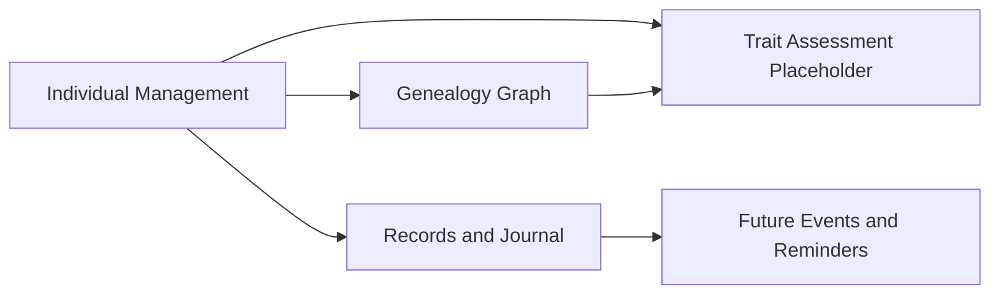
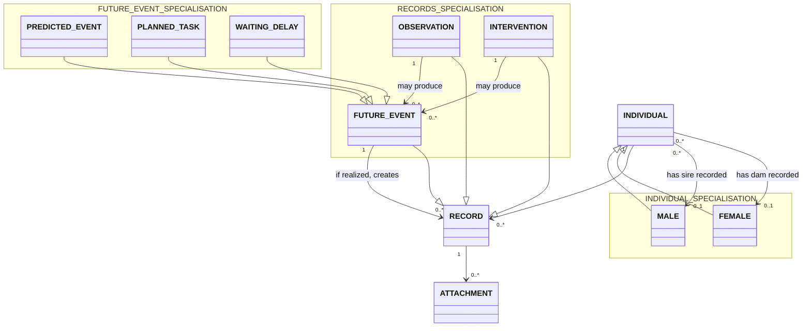

# 1. Overview

This model captures the shared business meaning of individual lifecycle, genealogy, records, interventions, observations, and derived future planning for the Geep scope, without implementation or persistence details.

## 2. Context Map

## 3. Business Object Model

## 4. Entity Descriptions

### Individual
- Bounded context: Individual Management.
- Key attributes: id, displayNameOrNumber, bdtaNumber (optional), birthDate, deathDate (optional), sex, color (optional), living, stillborn.
- Key business rules:
- Each individual has a mandatory unique internal identifier (FR-001 specs/REQUIREMENTS.md).
- BDTA number can be assigned later and is not required at first capture. (FR-001 specs/REQUIREMENTS.md).
- Stillborn individuals are represented with the same core identity and lineage fields; for stillborn, birth and death dates are the same and post-birth observation progression is constrained. (FR-001 specs/REQUIREMENTS.md).
- Individual is specialized into MaleIndividual and FemaleIndividual according to recorded sex. (FR-001 specs/REQUIREMENTS.md) and stakeholder direction.
- Parentage is modeled with two independent optional references: one dam (female parent) and one sire (male parent). (FR-001 specs/REQUIREMENTS.md), (FR-002 specs/REQUIREMENTS.md), and stakeholder direction.

### Male 
- Bounded context: Individual Management.
- Key attributes: inherits Individual attributes.
- Key business rules:
- Male is a specialization of Individual for individuals recorded with male sex. (FR-001 specs/REQUIREMENTS.md) and stakeholder direction.
- Male can be referenced as sire in parentage links. (FR-001 specs/REQUIREMENTS.md), (FR-002 specs/REQUIREMENTS.md), and stakeholder direction.

### Female
- Bounded context: Individual Management.
- Key attributes: inherits Individual attributes.
- Key business rules:
- Female is a specialization of Individual for individuals recorded with female sex. (FR-001 specs/REQUIREMENTS.md) and stakeholder direction.
- Female can be referenced as dam in parentage links. (FR-001 specs/REQUIREMENTS.md), (FR-002 specs/REQUIREMENTS.md), and stakeholder direction.

### Record
- Bounded context: Records and Journal.
- Key attributes: id, entryAt.
- Key business rules:
- Record is the supertype for Observation, Intervention, and FutureEvent.
- Each individual has a chronological record timeline. (FR-004 specs/REQUIREMENTS.md).
- Records can include associated attachments metadata. (FR-004 specs/REQUIREMENTS.md).

### Observation
- Bounded context: Records and Journal.
- Key attributes: id, observationType.
- Key business rules:
- Observation specializes Record.
- Observation includes weight evolution, health, and reproduction event entries. (FR-004 specs/REQUIREMENTS.md).
- Medical analysis results are modeled as observation content and do not require a separate business object. (FR-004 specs/REQUIREMENTS.md) and stakeholder direction.
- One observation can be applied to multiple individuals (batch workflow result). (FR-004 specs/REQUIREMENTS.md).

### Intervention
- Bounded context: Records and Journal.
- Key attributes: id, interventionType, reason (optional).
- Key business rules:
- Intervention specializes Record.
- Intervention captures performed actions tied to flock management operations.
- Intervention may produce one or many FutureEvent entries. Chapter 3 Business Object Model.
- Treatment is modeled as intervention content and does not require a separate business object. (FR-004 specs/REQUIREMENTS.md), (FR-006 specs/REQUIREMENTS.md), and stakeholder direction.

### FutureEvent
- Bounded context: Future Events and Reminders.
- Key attributes: id.
- Key business rules:
- FutureEvent specializes Record and is the parent concept for PredictedEvent, PlannedTask, and WaitingDelay.
- Future events are observations or interventions and can later be realized by creating new records. (FR-004 specs/REQUIREMENTS.md), (FR-005 specs/REQUIREMENTS.md), and Chapter 3 Business Object Model.

### PredictedEvent
- Bounded context: Future Events and Reminders.
- Key attributes: title, earliestDate, latestDate, status.
- Key business rules:
- PredictedEvent specializes FutureEvent.
- A mating observation can produce a predicted birth window between day 140 and day 150. (FR-004 specs/REQUIREMENTS.md).
- Predicted events may never happen.

### PlannedTask
- Bounded context: Future Events and Reminders.
- Key attributes: title, startReminderDate, dueDate, completionStatus.
- Key business rules:
- PlannedTask specializes FutureEvent.
- Confirmed birth can derive a weaning planned task around 3 months later. (FR-004 specs/REQUIREMENTS.md).

### WaitingDelay
- Bounded context: Future Events and Reminders.
- Key attributes: title, delayElapsedAt, elapsed.
- Key business rules:
- WaitingDelay specializes FutureEvent.
- WaitingDelay models elapsed periods such as intervention-related quarantine windows. (FR-004 specs/REQUIREMENTS.md).

### Attachment
- Bounded context: Records and Journal.
- Key attributes: id, attachmentType, label (optional), capturedAt (optional).
- Key business rules:
- Attachment metadata is associated with records for evidence and reference (for example photo or PDF). (FR-004 specs/REQUIREMENTS.md).

### TraitAssessment (Placeholder)
- Bounded context: Trait Assessment Placeholder.
- Key attributes: id, traitIdentifier, phenotype (optional), genotype (optional), genotypeConfirmed (optional).
- This business object is not yet completely defined and thus do not appears in chapter 3 diagram
- Key business rules:
- TraitAssessment captures FR-003 scope as an explicit placeholder while deduction algorithms remain unspecified. (FR-003 specs/REQUIREMENTS.md).
- Genotype can be unconfirmed and represent uncertainty. (FR-003 specs/REQUIREMENTS.md).
