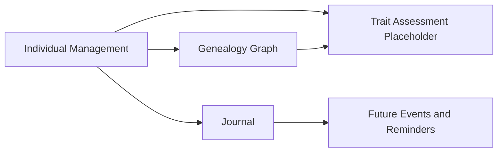

# 1. Overview

This model captures the shared business meaning of individual lifecycle, genealogy, observations, care, derived planning, and the FR-003 placeholder for Geep, without implementation or persistence details.

## 2. Context Map

## 3. Business Object Model

## 4. Entity Descriptions

### Individual
Individual represents a sheep in the flock with identity, lifecycle, and lineage information.

- Bounded context: Individual Management.
- Key attributes:
    - id (FR-001 specs/REQUIREMENTS.md)
    - name (optional)
    - bdtaNumber (optional) (FR-001 specs/REQUIREMENTS.md)
    - birthDate (FR-001 specs/REQUIREMENTS.md)
    - deathDate (optional) (FR-001 specs/REQUIREMENTS.md)
    - sex (FR-001 specs/REQUIREMENTS.md)
    - colorPattern (optional) (FR-001 specs/REQUIREMENTS.md)
    - living (FR-001 specs/REQUIREMENTS.md)
    - stillborn (FR-001 specs/REQUIREMENTS.md)
    - portraitReference (optional) (FR-001 specs/REQUIREMENTS.md)
    - sire (optional) (FR-001 specs/REQUIREMENTS.md, FR-002 specs/REQUIREMENTS.md)
    - dam (optional) (FR-001 specs/REQUIREMENTS.md, FR-002 specs/REQUIREMENTS.md)
- Key business rules:
    - Each individual has a mandatory unique internal identifier (FR-001 specs/REQUIREMENTS.md).
    - BDTA number can be assigned later and is not required at first capture (FR-001 specs/REQUIREMENTS.md).
    - Stillborn individuals keep the same core identity and lineage attributes; birth and death dates are the same and no post-birth observations are recorded (FR-001 specs/REQUIREMENTS.md).
    - For stillborns living status is always dead (FR-001 specs/REQUIREMENTS.md).
    - Each individual has a visual representation that may come from an observed portrait or a procedurally generated icon (FR-001 specs/REQUIREMENTS.md, FR-009 specs/REQUIREMENTS.md).
    - Parentage is modeled with at most one sire and at most one dam; the parent role must match sex semantics (FR-001 specs/REQUIREMENTS.md, FR-002 specs/REQUIREMENTS.md, TASK-0003 assumption).

### Male
Male is a specialization of Individual for individuals recorded with male sex (FR-001 specs/REQUIREMENTS.md).

- Bounded context: Individual Management.
- Key attributes:
    - inherits Individual attributes (FR-001 specs/REQUIREMENTS.md)
- Key business rules:
    - Male can play the sire role in parentage links (FR-001 specs/REQUIREMENTS.md, FR-002 specs/REQUIREMENTS.md).

### Female
Female is a specialization of Individual for individuals recorded with female sex (FR-001 specs/REQUIREMENTS.md).

- Bounded context: Individual Management.
- Key attributes:
    - inherits Individual attributes (FR-001 specs/REQUIREMENTS.md)
- Key business rules:
    - Female can play the dam role in parentage links (FR-001 specs/REQUIREMENTS.md, FR-002 specs/REQUIREMENTS.md).

### Record
Record is the shared journal entry supertype for Observation, Intervention, and FutureEvent (FR-004 specs/REQUIREMENTS.md).

- Bounded context: Records and Journal.
- Key attributes:
    - id
- Key business rules:
    - A record can appear in the journal of one or more individuals so batch capture is represented without losing per-individual chronology (FR-004 specs/REQUIREMENTS.md, TASK-0003 assumption).
    - Records may have attachments for evidence or reference, such as photos or PDFs (FR-004 specs/REQUIREMENTS.md).

### Observation
Observation specializes Record (FR-004 specs/REQUIREMENTS.md) and covers weight evolution, health observations, medical analysis results, and reproduction events (FR-004 specs/REQUIREMENTS.md).

- Bounded context: Records and Journal.
- Key attributes:
    - observationType (FR-004 specs/REQUIREMENTS.md)
    - observedAt (FR-004 specs/REQUIREMENTS.md)
    - content (FR-004 specs/REQUIREMENTS.md)
    - selectedIndividuals (FR-004 specs/REQUIREMENTS.md)
- Key business rules:
    - A single observation may be applied to multiple selected individuals (FR-004 specs/REQUIREMENTS.md).
    - Medical analysis results are stored as observation content and do not require a separate business object (FR-004 specs/REQUIREMENTS.md).

### Intervention
Intervention specializes Record (FR-004 specs/REQUIREMENTS.md) and captures performed actions, care and treatment information (FR-004 specs/REQUIREMENTS.md, FR-006 specs/REQUIREMENTS.md).

- Bounded context: Records and Journal.
- Key attributes:
    - interventionType (FR-004 specs/REQUIREMENTS.md)
    - performedAt (FR-004 specs/REQUIREMENTS.md)
    - selectedIndividuals (FR-004 specs/REQUIREMENTS.md)
- Key business rules:
    - A single intervention may be applied to multiple selected individuals (FR-004 specs/REQUIREMENTS.md).
    - Each type of Intervention can have specific attribute (for example dose quarantine periode for treatment)

### FutureEvent
FutureEvent represents a derived event or reminder that is planned, predicted, waiting, realized, or aborted depending on the context. It specializes Record and is the parent concept for PredictedEvent, PlannedTask, and WaitingDelay (FR-004 specs/REQUIREMENTS.md, FR-005 specs/REQUIREMENTS.md).

- Bounded context: Future Events and Reminders.
- Key attributes:
    - id
    - futureEventType (FR-004 specs/REQUIREMENTS.md, FR-005 specs/REQUIREMENTS.md)
    - status (FR-004 specs/REQUIREMENTS.md)
    - sourceRecord (FR-004 specs/REQUIREMENTS.md)
- Key business rules:

    - Future events are derived from observations or interventions and may later be realized by creating concrete records (FR-004 specs/REQUIREMENTS.md).
    - Future events may never occur, so the model must allow them to remain planned or predicted without realization or to be marked as aborted (FR-004 specs/REQUIREMENTS.md).

### PredictedEvent
PredictedEvent is a FutureEvent used for probabilistic  outcomes based on prior records. 
- Bounded context: Future Events and Reminders.
- Key attributes:
    - earliestDate (FR-004 specs/REQUIREMENTS.md)
    - latestDate (FR-004 specs/REQUIREMENTS.md)
    - status (FR-004 specs/REQUIREMENTS.md)
- Key business rules:
    - Mating observation can produce a predicted birth window between day 140 and day 150 (FR-004 specs/REQUIREMENTS.md).

### PlannedTask
PlannedTask is a FutureEvent representing a concrete upcoming action to perform. 

- Bounded context: Future Events and Reminders.
- Key attributes:
    - title
    - reminderDate (FR-004 specs/REQUIREMENTS.md, FR-005 specs/REQUIREMENTS.md)
    - dueDate (FR-004 specs/REQUIREMENTS.md, FR-005 specs/REQUIREMENTS.md)
    - completionStatus
- Key business rules:
    - A confirmed birth can derive a weaning planned task around 3 months later (FR-004 specs/REQUIREMENTS.md).

### WaitingDelay
WaitingDelay is a FutureEvent representing a delay interval that must elapse before normal operations resume.

- Bounded context: Future Events and Reminders.
- Key attributes:
    - title
    - delayElapsedAt (FR-004 specs/REQUIREMENTS.md)
    - elapsed (FR-004 specs/REQUIREMENTS.md)
- Key business rules:
    - WaitingDelay models elapsed periods such as intervention-related quarantine windows (FR-004 specs/REQUIREMENTS.md).

### Attachment
Attachment represents documentary evidence linked to a record.

- Bounded context: Records and Journal.
- Key attributes:
    - id
    - attachmentType (FR-004 specs/REQUIREMENTS.md)
    - label (optional)
    - capturedAt (optional)
- Key business rules:
    - Attachment metadata is associated with records for evidence and reference, such as photos or PDFs (FR-004 specs/REQUIREMENTS.md).

### TraitAssessment (Placeholder)
TraitAssessment is a placeholder entity for phenotype capture and uncertain genotype representation while deduction rules remain to be detailed.

- Bounded context: Trait Assessment Placeholder.
- Key attributes:
    - id
    - traitIdentifier (FR-003 specs/REQUIREMENTS.md)
    - phenotype (optional) (FR-003 specs/REQUIREMENTS.md)
    - genotype (optional) (FR-003 specs/REQUIREMENTS.md)
    - genotypeConfirmed (optional) (FR-003 specs/REQUIREMENTS.md)
- Key business rules:
    - TraitAssessment captures FR-003 as a placeholder capability while deduction rules remain unspecified (FR-003 specs/REQUIREMENTS.md).
    - Genotype can be unconfirmed and represent uncertainty, including multiple alleles for a gene when needed (FR-003 specs/REQUIREMENTS.md).
