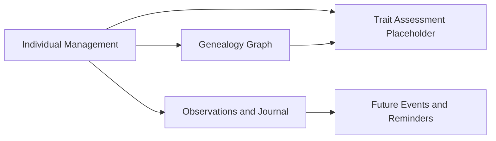
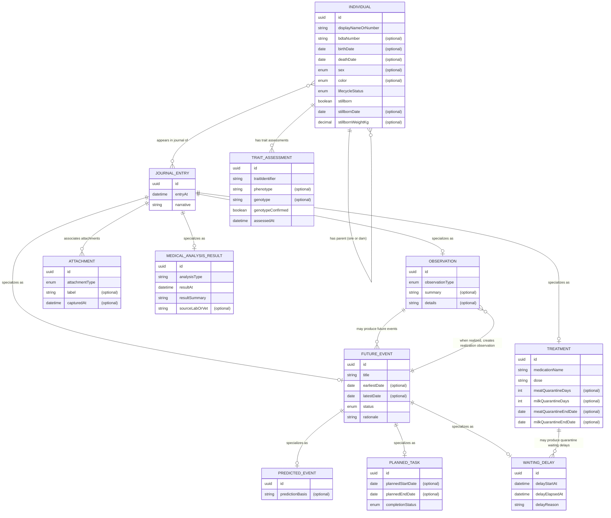

# 1. Overview

This domain model defines the persistence-agnostic business objects and relationships for the mobile MVP scope covering individual management, genealogy, observations, future events, and the FR-003 trait deduction placeholder.

## 2. Context Map

Context relationships:
- Individual Management is upstream for identity and lifecycle attributes used across the model.
- Genealogy Graph uses individuals and role-based parentage links (at minimum sire/dam).
- Observations and Journal records observation facts, treatment metadata, journal chronology, and references to supporting artifacts.
- Future Events and Reminders is downstream of observations and stores derived planning obligations.
- Trait Assessment Placeholder provides traceable FR-003 coverage without defining deduction algorithms.

## 3. Business Object Model

## 4. Entity Catalog

### Individual
- Bounded context: Individual Management.
- Key attributes: id, displayNameOrNumber, bdtaNumber (optional), birthDate (optional), deathDate (optional), sex (optional), color (optional), lifecycleStatus, stillborn, stillbornDate (optional), stillbornWeightKg (optional).
- Key business rules:
- Each individual has one mandatory unique internal identifier.
- BDTA number is optional at creation and may be assigned later.
- Birth and death dates are recorded when known; for stillborn, birth and death occur on the same date.
- Stillborn records are valid individuals with constrained lifecycle behavior (no post-birth observation progression).

### Observation
- Bounded context: Observations and Journal.
- Key attributes: id, observationType, summary (optional), details (optional).
- Key business rules:
- Observation is a specialization of JournalEntry.
- Observation types include weight evolution, health observations, and reproduction events.
- One observation entry can concern one or multiple individuals.

### Treatment
- Bounded context: Observations and Journal.
- Key attributes: id, medicationName, dose, meatQuarantineDays (optional), milkQuarantineDays (optional), meatQuarantineEndDate (optional), milkQuarantineEndDate (optional).
- Key business rules:
- Treatment is a specialization of JournalEntry.
- Treatment is captured when an observation records a medication action.
- Quarantine metadata is represented separately for meat and milk periods.

### FutureEvent
- Bounded context: Future Events and Reminders.
- Key attributes: id, title, earliestDate (optional), latestDate (optional), status, rationale.
- Key business rules:
- Future event is a specialization of JournalEntry.
- Future event is a parent concept specialized by PredictedEvent, PlannedTask, and WaitingDelay.
- Future events can be derived from triggering observations and treatment entries.
- A future event may or may not happen; when it happens, realization is captured as a new observation entry.

### PredictedEvent
- Bounded context: Future Events and Reminders.
- Key attributes: id, predictionBasis (optional).
- Key business rules:
- PredictedEvent is a specialization of FutureEvent.
- Represents events that might happen at an approximate date or date range.
- PredictedEvent may never happen.

### PlannedTask
- Bounded context: Future Events and Reminders.
- Key attributes: id, plannedStartDate (optional), plannedEndDate (optional), completionStatus.
- Key business rules:
- PlannedTask is a specialization of FutureEvent.
- Represents a task expected within a planned time range.
- Completion can be tracked; a task may remain uncompleted.

### WaitingDelay
- Bounded context: Future Events and Reminders.
- Key attributes: id, delayStartAt, delayElapsedAt, delayReason.
- Key business rules:
- WaitingDelay is a specialization of FutureEvent.
- Represents elapsed waiting periods such as quarantine delays.
- WaitingDelay is expected to happen when modeled.

### JournalEntry
- Bounded context: Observations and Journal.
- Key attributes: id, entryAt, narrative.
- Key business rules:
- JournalEntry is the supertype for Observation, Treatment, FutureEvent, and MedicalAnalysisResult.
- Each individual has a chronological journal timeline.
- Journal includes observation facts, future-event facts, treatment traceability fields, and related references.

### Attachment
- Bounded context: Observations and Journal.
- Key attributes: id, attachmentType, label (optional), capturedAt (optional).
- Key business rules:
- Attachments are represented as metadata references (for example photo/PDF identity) associated with journal entries.

### MedicalAnalysisResult
- Bounded context: Observations and Journal.
- Key attributes: id, analysisType, resultAt, resultSummary, sourceLabOrVet (optional).
- Key business rules:
- Medical analysis result is a specialization of JournalEntry.
- Medical analysis outcomes are captured as structured journal-linked domain facts.

### TraitAssessment (Placeholder)
- Bounded context: Trait Assessment Placeholder.
- Key attributes: id, traitIdentifier, phenotype (optional), genotype (optional), genotypeConfirmed, assessedAt.
- Key business rules:
- Provides FR-003 placeholder coverage only.
- Genotype may be uncertain (genotypeConfirmed = false) pending later deduction-rule specifications.
