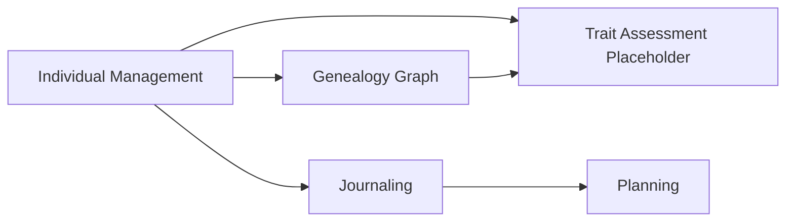

# Context Map

This model captures the shared business meaning of individual lifecycle, genealogy, observations, care, derived planning, and the REQ-03.001, REQ-03.002, and REQ-03.003 placeholder for Geep, without implementation or persistence details.

## Context Descriptions

### Individual Management
Manages the lifecycle and identity of individuals, including registration, status, and parentage links used by downstream contexts.

### Genealogy Graph
Represents lineage relationships between individuals and supports ancestry-based reasoning and navigation.

### Journaling
Captures observations, interventions, and related evidence as chronological records associated with one or more individuals.

### Planning
Holds future-oriented items derived from journal activity, including predictions, planned actions, and waiting delays.

### Trait Assessment Placeholder
Reserves the domain area for phenotype capture and uncertain genotype representation until detailed deduction rules are defined.