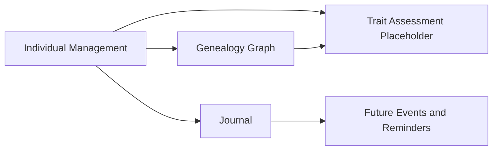

# Context Map

This model captures the shared business meaning of individual lifecycle, genealogy, observations, care, derived planning, and the REQ-03.001, REQ-03.002, REQ-03.003, and REQ-03.004 placeholder for Geep, without implementation or persistence details.

