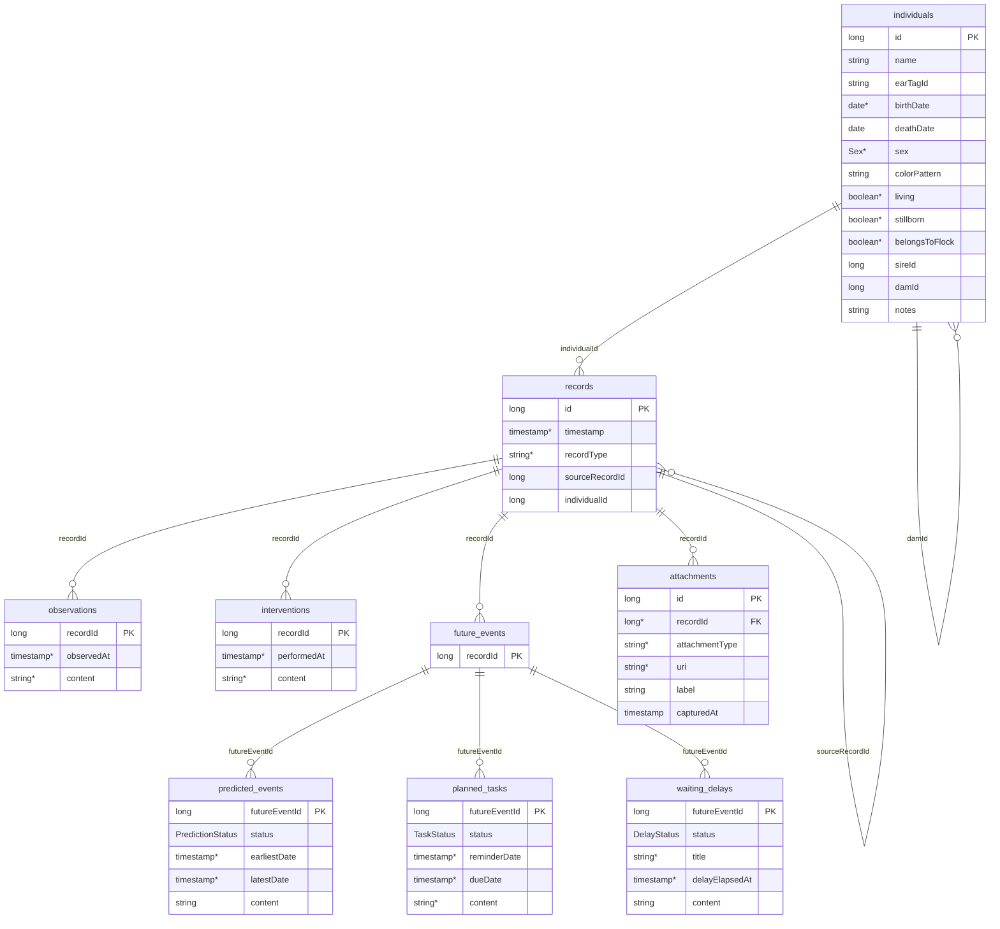

# Room database schema

## Notes

- Mandatory (non-null) columns are marked with `*` after the type. Columns without `*` are nullable. Primary keys are inherently mandatory and are not double-marked.
- `sireId`, `damId`, and `sourceRecordId` are logical references only (no Room `ForeignKey` constraint configured).
- Indexes: `observations(recordId)`, `interventions(recordId)`, `future_events(recordId)`, `predicted_events(futureEventId)`, `planned_tasks(futureEventId)`, `waiting_delays(futureEventId)`, `attachments(recordId)`, `records(individualId)`.
- Foreign keys with `ON DELETE CASCADE`: all subtype tables cascade to their parent.
- **Record Type**: recordType can only have the values `OBSERVATION`, `INTERVENTION`, or `FUTURE_EVENT`.
- **Flock Membership**: Observation types `FLOCK_ENTRY` and `FLOCK_EXIT` track flock membership (REQ-01.008). Entry reasons: `BIRTH`, `PURCHASE`. Exit reasons: `SOLD`, `SLAUGHTERED`, `DECEASED`. An individual with `belongsToFlock = false` has no such Observations. The `belongsToFlock` flag distinguishes flock individuals from **Lineage individuals** (who exist only for genealogy).
- **Content JSON**: The `content` column in `observations` and `interventions` contains a JSON string with the type discriminator and event-specific data. For `planned_tasks`, the `content` JSON includes the title and other task-specific attributes. For `predicted_events` and `waiting_delays`, the `content` JSON holds type-specific metadata.
- **Sub-type Statuses**: Each future event sub-type has its own status type: `predicted_events` uses `PredictionStatus`, `planned_tasks` uses `TaskStatus`, `waiting_delays` uses `DelayStatus`. Acceptable values may differ by sub-type.
- **UTC timestamps**: All `timestamp` columns store absolute UTC timestamps as ISO-8601 strings ending with `Z` (e.g. `2024-06-01T10:00:00Z`). `LocalDate` columns (`birthDate`, `deathDate`) are calendar dates with neither time nor timezone.
